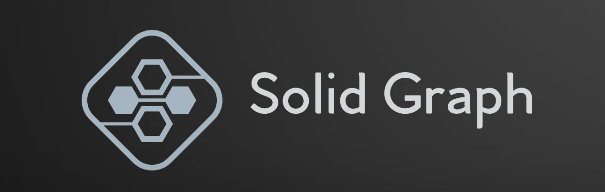

<div align="center">
<h1><h1>
<a href="https://npmjs.com/package/odysea"></a>
<a href="https://github.com/AlidotSal/odysea/blob/main/LICENSE"></a>
<a href="https://www.typescriptlang.org/"></a>

<a href="https://github.com/AlidotSal/odysea/stargazers"></a>

### Convert Your Ideas To A Simple And Excitig Journay With Odysea!

<br/>
</div>

# Odysea

> A lightweight and minimal Solid component for building interactive graphs and node-based editors.

## Key Features

- **Easy to use:** Just provide the nodes and edges data and it automatically gets converted to an interactive graph with seamless zooming and panning.
- **Customizable:** Different edge types and support for custom nodes and custom edges.
- **Fast rendering:** Only nodes that have changed are re-rendered and only those in the viewport are displayed
- **Reliable**: Written in [Typescript](https://www.typescriptlang.org/).

## Installation

The easiest way to get the latest version of Solid Graph is to install it via npm:

```bash
npm install odysea # or yarn add
```

## Quick Start

```jsx
import Flow from "odysea";

function Flow(props) {
  return <Flow nodes={props.nodes} edges={props.edges}></Flow>;
}
```

## Flow Component's Props

| Name   | Type   | default | Description             |
| ------ | ------ | ------- | ----------------------- |
| nodes  | Node[] | []      | array of nodes          |
| edges  | Edge[] | []      | array of edges          |
| width  | number | 800     | width of the container  |
| height | number | 800     | height of the container |

```jsx
type Node = {
  id: number,
  data: T,
  position: XYPosition,
  inputPosition?: Position,
  outputPosition?: Position,
  width?: number,
  height?: number,
  inputHandle?: boolean,
  outputHandle?: boolean,
  bgColor?: string,
  fontSize?: number,
  borderColor?: string,
  borderRadius?: number,
  textColor?: string,
};

type Edge = {
  source: number,
  target: number,
  label?: string,
  type?: "bezier(default)" | "straight" | "smoothStep" | "step",
  animated?: boolean,
  arrow?: boolean,
  style?: JSX.CSSProperties,
  labelStyle?: JSX.CSSProperties,
  labelBgStyle?: JSX.CSSProperties,
};
```

## Example

[Live Example On stackblitz](https://stackblitz.com/edit/vitejs-vite-2wlkrn?file=src/App.tsx)

- Pan: alt + drag
- Zoom: mouse wheel

## Development

Before you start you need to build the project using `npm run build`. Then install the Solid Graph dependencies via `npm install`.

If you want to contribute or develop custom features the easiest way is to start the dev server:

```sh
npm start
```

## Credits

Solid Graph is heavily based on [react flow](https://github.com/wbkd/react-flow). Without them Solid Graph would not exist. Please consider donating to them.

- [solid-styled](https://github.com/LXSMNSYC/solid-styled) - for styling components

## License

Solid Graph is [MIT licensed](https://github.com/AlidotSal/odysea/blob/main/LICENSE).
